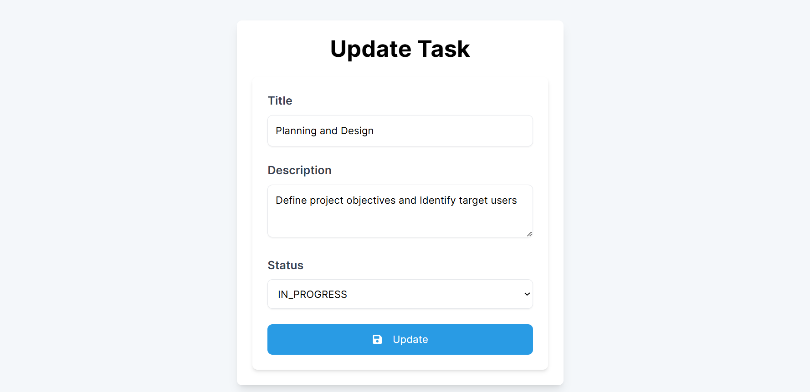
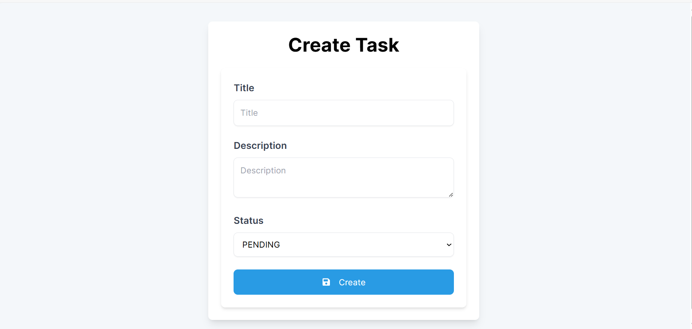
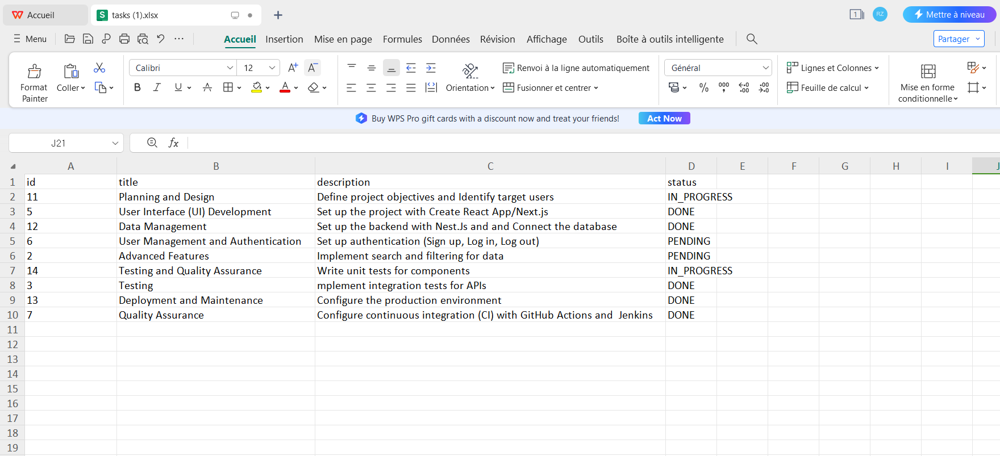
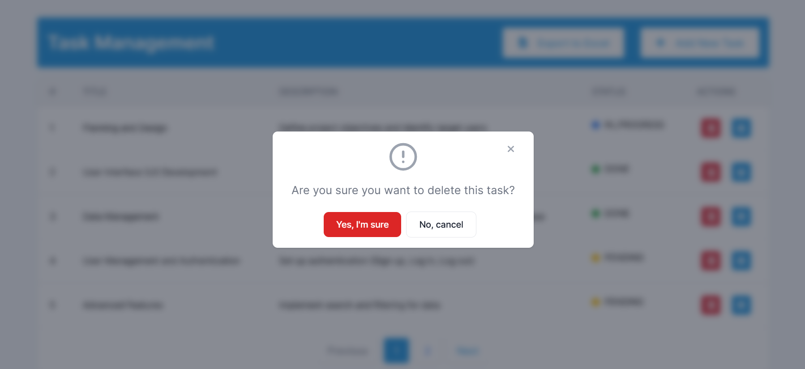

# Task Management App

This project is a Task Management Application, developed using NestJS for the backend, Next.js for the frontend, and PostgreSQL for the database. The application allows users to create, read, update, and delete tasks, with each task having a title, description, and status.

## Project Structure

- `backend`: Contains the NestJS backend application
- `frontend`: Contains the Next.js frontend application
- `dockerfiles`: Docker configurations for the project
- `pictures`: Images and other static assets
- `postgres_data`: PostgreSQL data directory
- `docker-compose.yml`: Docker Compose configuration file

## Manual Setup

 <blockquote>
<p dir="auto">Make sure Docker is installed.</p>
</blockquote>

### Instructions
1. **Clone the repository:**
   ```bash
   git clone https://github.com/ranizouaoui/Task-Management-App/
   cd Task-Management-App
   ```
2. **Build the Docker images and start the containers::**
   ```bash
    docker-compose up --build
   ```

3. **Build the Docker images and start the containers::**

- **Frontend:** Open your browser and go to http://localhost:3000
- **Backend:** The Nest.Js API will be running at http://localhost:5000

## Documentation

- <a href="https://github.com/ranizouaoui/Task-Management-App/blob/main/frontend/README.md">Frontend Documentation</a>
- <a href="https://github.com/ranizouaoui/Task-Management-App/tree/main/backend">Backend Documentation</a>
- <a href="https://github.com/ranizouaoui/Task-Management-App/tree/main/backend">Postgres Documentation</a>

## App preview







